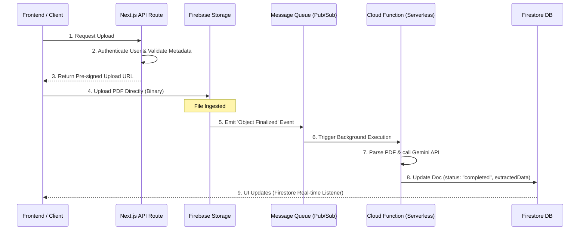

# PrepAI — Mock Interview & AI Evaluation Platform
## Full Architecture & Interview Preparation Guide (Q&A)

This document serves as a comprehensive technical guide for mock interviews. It covers the high-level architecture, deep-dive implementation details, and structural Q&A for commonly asked system design, API, database, and scaling questions.

---

## 🎯 1. Project Pitch / High-Level System Explanation
**"Can you walk me through your project and explain how the system works end-to-end?"**

### **The Walkthrough**
PrepAI is a voice-first, AI-powered mock interview and automated feedback platform. The entire end-to-end workflow operates as follows:

1. **Resume Processing & Parsing:**
   * The user uploads their resume (PDF). Our backend receives it and securely processes it.
   * We leverage **Gemini 2.5 Flash (via Vercel AI SDK)** to parse the raw PDF bytes, extracting structured JSON data containing the candidate’s name, education, experiences, skills, and specific project features.
   * This structured text is stored in our **Firestore database** under the `resumes` collection.

2. **Custom Interview Setup:**
   * Candidates configure their mock session using a setup form, choosing parameters like **Target Role**, **Target Company**, **Interview Type** (Technical, Behavioral, Mixed, System Design), **Experience Level**, **Depth Strategy** (Balanced, Depth, or Breadth), and **Question Count**.
   * We trigger our backend generator which merges the user's resume data, custom parameters, and contextual prompt templates. It calls Gemini to generate a sequence of main questions. Each question is generated with **2 to 4 conditional follow-up questions** (with conditions like *"If candidate fails to explain X"* or *"If candidate is highly confident"*).
   * Optionally, the system can fetch top industry/company-specific questions via a web scraping/search integration.

3. **Streaming Voice Pipeline (WebRTC):**
   * The interview begins. The Next.js frontend connects to **Vapi AI's WebRTC infrastructure** using the Web SDK.
   * Vapi orchestrates the entire real-time streaming pipeline:
     * **Voice Activity Detection (VAD) & Turn Detection:** Detects when the user is speaking vs. when they have finished.
     * **Speech-to-Text (STT):** Streams user microphone input over WebSockets to **Deepgram (Nova-2)** for sub-100ms real-time transcription.
     * **Language Model (LLM):** Passes the transcription and conversation history to **OpenAI GPT-4o-mini** acting as the interviewer, using our customized prompts, dynamic question paths, and follow-up conditions.
     * **Text-to-Speech (TTS):** Converts the bot's generated response into a natural human-like voice using **ElevenLabs (Sarah)**, streaming the audio chunks back to the browser.
     * **Barge-in / Interruption Handling:** Enables the user to interrupt the bot naturally, immediately stopping bot playback if the candidate starts speaking.

4. **Post-Call Evaluation & Analytics:**
   * Once the call is disconnected or finishes, the local WebRTC client grabs the conversation history. If the connection dropped abruptly, the backend uses a fallback route to fetch the official transcript from Vapi's REST API using the `callId`.
   * **Transcript Preprocessing:** The backend collapses sentence fragments (merging small speaker chunks) and counts stats for mumbling, consecutive repetition phrases, and filler words (e.g., "um", "uh", "like", "basically"). Crucially, we do **not** strip these words from the text to ensure the LLM gets the candidate's exact raw answer.
   * **Gemini Evaluation:** The full raw transcript and prepended question list are sent to Gemini. Gemini performs a multi-dimensional analysis scoring each answer (0–100) on: **Technical Accuracy, Clarity, Depth, and Confidence**, alongside generating a constructive summary ("What went well" vs. "Improve on").
   * **UI Visualization:** The feedback page renders color-coded overall scores (Red/Orange/Green), progress bars for categories, and cards for each answer showing their individual scores and warning banners for incomplete questions.

5. **Future Roadmap:**
   * To decouple our platform from third-party orchestrators like Vapi, we plan to transition to open-source self-hosted solutions like **LiveKit Agents** (WebRTC gateway) or **Dograh AI** (Visual voice workflow builder) combined with direct Gemini Multimodal Live API calls to bypass intermediate STT/TTS layers and further reduce latency to sub-200ms.

---

## 🛠️ 2. Detailed Q&A for Technical Interviews

### **Q1: How is Authentication (Auth) handled in this application?**
**Answer:**
We use a secure hybrid session model combining **Firebase Client SDK**, **Next.js Server Actions**, and **Firebase Admin SDK (Session Cookies)**:
1. **Sign-up / Sign-in Flow:** The candidate enters their email and password on our Next.js frontend. The Firebase Client SDK authenticates them and retrieves a short-lived JSON Web Token (`idToken`).
2. **Session Cookie Exchange:** The `idToken` is sent to a backend Server Action (`signIn`). The server calls `auth.createSessionCookie(idToken, { expiresIn: OneWeek })` using the Firebase Admin SDK.
3. **Secure Storage:** The generated session cookie is saved in the browser cookies under the name `session` with flags: `httpOnly: true` (prevents XSS reading), `secure: true` (HTTPS-only in production), `sameSite: 'lax'`, and `path: '/'`.
4. **Session Verification:** To check authentication on page routes and API calls, `getCurrentUser()` reads this HTTP-only cookie and calls `auth.verifySessionCookie(sessionCookie, true)` on the server. If valid, the user's profile is fetched from the Firestore `users` collection.
* *Note: The architecture makes it incredibly easy to scale to OAuth (like Google, GitHub) in the future since Firebase Auth natively supports federated sign-in on the client, returning the exact same `idToken` format for cookie exchange.*

---

### **Q2: Can you describe the database design (NoSQL / Firestore) and query indexing?**
**Answer:**
We use **Google Cloud Firestore (NoSQL Document Store)** because it is highly scalable, supports real-time subscriptions, and stores schema-flexible hierarchical data. We have four core root collections:

1. **`users` (Keyed by Firebase Auth UID):**
   * Schema: `name (string)`, `email (string)`, `profilePicture (string)`, `profileInitials (string)`, `createdAt (ISO String)`.
2. **`resumes` (Keyed by Random Doc ID):**
   * Schema: `userId (string)`, `fileName (string)`, `status (processing | completed | failed)`, `createdAt (ISO String)`, `extractedData (map)`.
3. **`interviews` (Keyed by Random Doc ID):**
   * Schema: `userId (string)`, `role (string)`, `level (string)`, `type (string)`, `techstack (array)`, `questions (array of strings)`, `structuredQuestions (array of maps with follow-ups)`, `resumeId (string | null)`, `resumeName (string)`, `targetCompany (string)`, `depthStrategy (string)`, `customNotes (string)`, `questionCount (number)`, `finalized (boolean)`, `coverImage (string)`, `createdAt (ISO String)`.
4. **`feedback` (Keyed by Random Doc ID):**
   * Schema: `interviewId (string)`, `userId (string)`, `totalScore (number)`, `categoryScores (array of maps)`, `strengths (array)`, `areasForImprovement (array)`, `finalAssessment (string)`, `answerEvaluations (array of structured question scores)`, `fillerWordCount (number)`, `repetitionCount (number)`, `transcript (array of role/content turns)`, `createdAt (ISO String)`.

---

#### 🧠 **Deep Dive: What is Database Indexing, How does it work, and Why do we need it?**

* **What is an Index? (The Book Analogy):**
  Imagine you have a 1,000-page book on Programming and you want to find all pages talking about "React". 
  * **Without an Index (Linear Scan / $O(N)$):** You would have to flip through the book page-by-page, from page 1 to 1000, checking every sentence. If the book grows to 100,000 pages, this search takes 100x longer.
  * **With an Index (Index Lookup / $O(\log N)$):** You turn to the alphabetical index at the back of the book. You find the letter **R**, locate "React", see page numbers `12, 148, 502`, and flip directly to those pages.
  * **In Databases:** An index is a separate, hidden data structure that holds pointers to the actual documents, pre-sorted by specific fields.

* **How it works under the hood (B-Trees):**
  Most databases (including Firestore) structure their indexes using a **B-Tree** (Balanced Tree) or similar tree structures. 
  * The tree keeps keys sorted.
  * When you query `userId == 'user_123'`, the database starts at the root node of the B-Tree and performs a **binary search** (asking: *"is user_123 greater or smaller than the current node?"*). 
  * This cuts the search space in half at every step, transforming a slow $O(N)$ lookup (checking every document) into a lightning-fast $O(\log N)$ lookup (checking only a few tree nodes).

* **Firestore Indexing Rules:**
  1. **Single-Field Indexes:** Firestore automatically indexes every single field in every document by default. That's why simple filters like `.where('userId', '==', userId)` are instant out-of-the-box.
  2. **Composite Indexes:** If you combine fields in a single query (e.g., `.where('userId', '==', userId).orderBy('createdAt', 'desc')`), Firestore cannot merge separate single-field indexes efficiently. It requires a **Composite Index** (a multi-column index sorting by `userId` and `createdAt` together). Without it, Firestore will reject the query and output a URL in the console directing you to create it.
  3. **Our current approach:** In the current prototype actions, complex sorting is handled in-memory (`list.sort()`) to bypass requiring database-level composite indexes during local development, but a production system would define compound indexes in a `firestore.indexes.json` file.

---

### **Q3: How do you scale resume storage and text extraction when user volume increases?**
**Answer:**

#### 🚀 **Our Current Prototype Approach:**
Currently, our Next.js backend parses the upload file to a base64 string, sends a JSON response instantly, and runs the extraction in the background using the Next.js `after()` API to avoid making the user wait. 

#### 📈 **The Production Scalable Solution (Firebase Storage + Cloud Functions):**
To support thousands of concurrent uploads without degrading web server performance, we should replace base64 backend processing with a **fully decoupled, event-driven serverless pipeline** using **Firebase Storage** and **Google Cloud Functions**.



---

#### 🧠 **Understanding the Core Serverless Stack**

##### **1. What is Firebase Storage?**
* **Definition:** A secure object storage service optimized for storing and serving user-generated files (like PDFs, images, and videos) backed by **Google Cloud Storage (GCS)**.
* **Why we use it instead of a database:** Databases are designed for structured text/queries and are extremely expensive and slow at storing large files. Firebase Storage is highly optimized for binary large objects (BLOBs), cheap, and handles horizontal scaling out-of-the-box.
* **How it works:** Files are stored in "buckets". The frontend can upload files directly to a bucket using a **Pre-signed URL** generated by the server, meaning binary data never touches or slows down our application servers.

##### **2. What are Google Cloud Functions?**
* **Definition:** A **Function-as-a-Service (FaaS)** serverless platform. You write small, stateless pieces of code (functions) that run in isolated containers.
* **Why they are called serverless:** You do not manage, provision, configure, or scale any virtual machines or operating systems. Google handles all the hardware under the hood.
* **How they trigger:** Cloud Functions are event-driven. They sleep and consume **$0** in resources until they are woken up by an event trigger (like *"a new file has been created in Firebase Storage"* or *"an HTTP request is made"*). 
* **Scaling:** If 10 users upload files, 10 container instances spin up in parallel. If 10,000 users upload files, Google automatically provisions 10,000 instances to run the tasks in parallel and scales them back down to zero when done.

##### **3. Why this combination is highly scalable:**
1. **Zero Web Server Overhead:** Our Next.js web application servers do not have to consume RAM downloading, buffering, or processing binary files. The frontend uploads files directly to the storage bucket.
2. **Infinite Parallelism:** The heavy CPU task of reading PDF structures and the slow network task of calling the Gemini API are offloaded to Cloud Functions, which scale automatically.
3. **Resiliency & Fault Tolerance:** If a Cloud Function fails (e.g. Gemini rate limits us with an HTTP 429), Google Cloud Pub/Sub will automatically queue the event and retry the function. The user's experience is unaffected; the frontend real-time listener will simply show "retrying" until the function completes.


"The client uploads the PDF directly to Firebase Storage using either the Firebase SDK or a signed URL. When the upload completes, Google Cloud Storage emits an Object Finalized event. This event automatically triggers a Cloud Function. The function downloads the PDF from the bucket, converts it into a buffer, and executes the same Gemini extraction logic that currently exists in our Next.js backend. The structured JSON output is then written into Firestore and the document status is updated from processing to completed. Since Firestore supports real-time listeners, the frontend automatically receives the update without polling. This architecture completely decouples file processing from the web server and scales horizontally because Cloud Functions automatically create additional instances for concurrent uploads."
---

### **Q4: How exactly is the resume PDF parsed and structured data extracted?**
**Answer:**
We use a multimodal ingestion pipeline:
1. The PDF is converted into a base64-encoded binary buffer.
2. We send this buffer directly to the **Gemini 2.5 Flash** model via the Vercel AI SDK using the `generateText` method. We attach the file object with MIME type `application/pdf`.
3. We provide a highly strict system instructions template and Zod-style schema directly in the prompt, instructing Gemini to return a clean JSON object containing `name`, `skills`, `projects`, `experience`, `education`, and an evaluated `experienceLevel` (fresher, junior, mid, senior).
4. Our server parses the resulting JSON string, cleans up potential markdown fences (` ```json `), and stores the parsed JSON map into the Firestore database document for that resume.

---

### **Q5: How does the web scraping component work to get top company-specific questions?**
**Answer:**
Since web pages like Glassdoor or LeetCode have strict anti-scraping protections (Cloudflare barriers, CAPTCHAs, dynamic JS renders), running simple HTTP requests using `axios` or `cheerio` will get blocked immediately. 

To implement a reliable production scraping pipeline:
1. **Headless Automation:** We use **Puppeteer** (or Playwright) running in a serverless container environment with a stealth plugin to mimic standard human browser behaviors (setting user-agent headers, screen viewports, and mouse micro-motions).
2. **Rotating Residential Proxies:** We integrate with proxy services (like Bright Data or ScraperAPI) to rotate IP addresses on every request, bypassing IP-based rate-limits.
3. **Search API Fallback (Best Practice):** Instead of parsing complex, changing HTML selectors of target sites directly, we query search engine APIs (like **Tavily Search** or **Jina Reader**) using search terms: `"[Company] [Role] interview questions site:glassdoor.com OR site:leetcode.com"`.
4. **LLM Extraction:** We feed the search result text snippets into Gemini, asking it to clean, filter, and extract a list of standard question strings.
5. **Caching Layer:** We cache scraped questions in a `company_questions` Firestore collection keyed by `company_role`. When a user sets up an interview, we first check the cache. If it exists, we load it instantly (0ms latency). If not, we scrape it asynchronously and cache it for future users.

---

### **Q6: How are questions generated and fed into Vapi?**
**Answer:**
1. **Dynamic Prompt Assembly:** When creating an interview, we compile a system prompt. If a resume is present, we format all projects, technologies, and roles into a text block. We also append target company constraints, experience levels, depth strategies, and the generated structured questions list.
2. **Structure Question Mapping:** The questions are sent to Gemini to generate the main questions with structured `QuestionFollowUp` arrays containing specific condition checks.
3. **Vapi Assistant Override:** Instead of using a static assistant configured on Vapi's console, we dynamically build an assistant payload on our backend using `buildInterviewerConfig()`. We override the `assistant.model.messages[0].content` with our generated system prompt, which lists the exact questions to ask and rules for turn-taking.
4. **Vapi Start Call:** The client Web SDK receives this custom assistant configuration from our backend API and starts the WebRTC audio streaming call.

---

### **Q7: How does the resume evaluation work (both preprocessing and the Gemini prompt)?**
**Answer:**
The post-interview feedback consists of two phases:

**Phase 1: Local Preprocessing (Stats & Word Retention)**
* We collapse the transcript: consecutive fragments spoken by the same speaker are merged into complete sentences for natural reading.
* We loop through the text and use regex patterns to calculate:
  * **Filler words:** Counting occurrences of "um", "uh", "basically", "like", "honestly".
  * **Repetitions:** Detecting consecutive duplicate words/phrases (e.g. "I think, I think...").
* Crucially, we **do not strip** these filler words from the transcript sent to Gemini. This allows the LLM to inspect the exact cadence of speech to determine structural clarity.

**Phase 2: Gemini Evaluation Prompt**
* The full merged transcript and the main question list are fed to Gemini using a strict JSON schema.
* We instruct Gemini to identify the exact parts of the conversation where a question was answered.
* **Scoring Rules:**
  * **Answered Questions:** Evaluated across four metrics: Technical Accuracy (correctness), Clarity (articulation), Depth (detail), and Confidence. The overall score is the average.
  * **Incomplete Questions (Call cut off mid-answer):** Set all scores to 0, whatWentWell to `"Interview ended before this answer was completed."`, and include whatever partial transcript exists in the `answer` field.
  * **Unanswered Questions (Not reached):** Set all scores to 0, whatWentWell to `"This question was not reached."`.
* Gemini outputs the per-question assessments and overall category ratings, which are saved to Firestore and visualized on the client.

---

### **Q8: Can you explain Vapi's architecture, streaming voice pipeline, and how STT/TTS work?**
**Answer:**
Vapi acts as a low-latency WebRTC orchestration gateway. 

* **The Streaming Pipeline:**
  1. The client's microphone captures audio, sending it as real-time binary audio streams over a secure **WebRTC** connection to Vapi's servers.
  2. **VAD (Voice Activity Detection):** Vapi runs VAD algorithms at the edge to determine when a user is speaking vs. when they are silent.
  3. **STT (Speech-to-Text):** The audio stream is forwarded via WebSockets to **Deepgram (Nova-2)**. Deepgram translates the raw sound frequencies into text strings on-the-fly.
  4. **The LLM (Brain):** The resulting text is appended to the dialogue history and sent to the LLM (e.g., GPT-4o-mini). The LLM processes the input and streams the response text back.
  5. **TTS (Text-to-Speech):** As text streams from the LLM, it is fed to **ElevenLabs**. ElevenLabs synthesizes the text into audio waves.
  6. **Audio Streaming:** The audio waves are streamed back to the user's browser via WebRTC for instant playback.
  7. **Barge-in / Interruption:** If VAD detects user speech while ElevenLabs audio is playing, Vapi immediately stops the outgoing WebRTC audio stream, allowing the candidate to interrupt naturally.

* **Are STT and TTS Language Models?**
  * **No.** STT models (like Deepgram) are acoustic-phonetic neural networks trained to map audio waveforms to phonetic characters and text. They do not "understand" meaning or reason.
  * TTS models (like ElevenLabs) are generative audio synthesis models that convert text characters into natural waveform patterns, matching human prosody, tone, and pacing.
  * The LLM is the only actual language model in the stack. It handles reasoning, semantic comprehension, and context management.

---

#### 🌐 **Deep Dive: WebRTC vs. WebSockets in Real-Time Voice Apps**

| Feature | WebRTC (Web Real-Time Communication) | WebSockets |
| :--- | :--- | :--- |
| **Primary Design** | Low-latency streaming of media (audio/video/data) | Bi-directional, full-duplex text/binary messages |
| **Protocol** | Primarily **UDP** (User Datagram Protocol) | **TCP** (Transmission Control Protocol) |
| **Reliability** | **Unreliable / Unordered** (Drops bad/delayed frames to prevent lag) | **Reliable / Ordered** (Guarantees every packet arrives in order) |
| **Latency** | **Ultra-Low (<200ms)** | Low (~100ms - 500ms depending on TCP handshakes) |
| **Connection** | Direct peer-to-peer (or via TURN media relay) | Client-to-Server connection |

* **Why we use WebRTC for Audio:**
  In a voice call, keeping latency low is the absolute priority. If a packet of your audio is delayed by a split second due to network jitter, we want the system to **drop it** and keep playing the live stream rather than buffering and waiting for the lost packet to be re-transmitted (which would cause a massive, laggy delay). WebRTC runs on UDP, making this instant, low-latency streaming possible.
* **Why we use WebSockets for Text & Control:**
  When translating transcription data (Speech-to-Text), or sending control signals (like starting or stopping the interview), we **cannot afford to lose any data**. A missing character or word could change the entire meaning of an answer. WebSockets use TCP, ensuring that text tokens and control parameters are delivered 100% reliably and in the correct order.

---

## 💡 3. Extra Interview Questions & Answers

### **Q9: How do you handle network drops or page refreshes during an active call?**
**Answer:**

#### 🛠️ **Our Current Prototype Implementation:**
1. **Client-Side State:** We use a React `useRef` to store the Vapi `callId` as soon as the `call-start` event fires, and track the state in a local state variable `callStatus`.
2. **Abrupt Disconnection Handling:** If the client disconnects or an error is thrown, the `onCallError` event listener triggers automatically on the client. We immediately force the client's `callStatus` to `FINISHED`.
3. **The Fallback API:** Changing the status to `FINISHED` triggers the client to call the feedback generation endpoint. If the local state transcript is empty (due to data loss on page crash/refresh), the backend fetch request uses the saved `callId` to query Vapi's REST API `/api/vapi/transcript?callId=...`, pulling the complete audio logs securely stored in Vapi's cloud.

#### 📈 **Production Scaling Strategy (Database Session Cache):**
If the user's browser completely crashes or they close the tab, the client-side memory (`useRef` / React state) is lost. To prevent this in a production-ready application:
1. **Save Session ID on DB:** As soon as Vapi starts the call, the backend should write the `vapiCallId` directly into the Firestore `interviews` document (acting as a **database session cache**).
2. **Post-Disconnect Webhooks:** Instead of relying on the client's browser to send the feedback request, we register a **Webhook endpoint** on our backend (e.g., `/api/webhooks/vapi`).
3. **Automated Processing:** When the call ends, Vapi sends an asynchronous `call.completed` event to our webhook. Our server reads the `vapiCallId` and the transcript from the webhook payload, updates Firestore, and triggers the Gemini evaluation completely in the background—requiring zero browser connection.

---

### **Q10: What are your main strategies to minimize latency in the voice chat?**
**Answer:**
Conversational delay (lag) ruins the interview feel. We minimize it using three techniques:
1. **WebRTC over HTTP/WebSockets:** Using WebRTC for audio transport eliminates the buffering overhead of standard media protocols, streaming audio packet-by-packet.
2. **LLM Response Streaming:** We use models that support tokens streaming (like GPT-4o-mini). ElevenLabs begins synthesizing voice from the first few words streamed, rather than waiting for the entire sentence to complete.
3. **Geographic Proximity:** Deploying the Vapi server instances close to the target user base (e.g. US-East vs. AP-South) minimizes physical routing latency.

### **Q11: Why did you choose Firestore over PostgreSQL for this specific project?**
**Answer:**
1. **Real-time Synchronization:** Firestore's native `onSnapshot()` allows us to listen to document state changes (like resume extraction completion) directly from the client without writing complex polling APIs or hosting custom Socket.io servers.
2. **Dynamic Schemas:** Resume extraction output varies heavily based on candidate backgrounds. Storing this as a flexible nested NoSQL JSON structure is cleaner than mapping highly variable nested JSON columns in a traditional relational database.
3. **Serverless Scalability:** Firestore scales connection handling automatically, whereas traditional PostgreSQL databases require connection pooling configurations (like PgBouncer) to handle spikes in concurrent serverless API functions.
